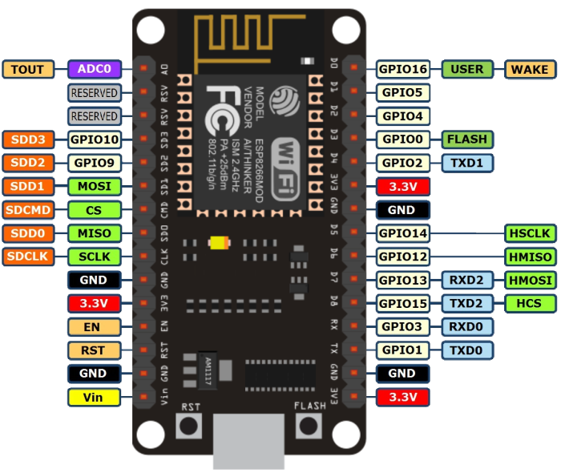

# Microcontroller code - emot <!-- omit in toc -->

- [Sobre](#sobre)
- [Funcionamento](#funcionamento)
- [NodeMCU](#nodemcu)

## Sobre

Código usado no microcontrolador do projeto **The Amazing Flower Monitor** (emot). A descrição complementar do projeto está disponível em [emot-test](https://github.com/kevendasilva/emot-test#sobre).

## Funcionamento

Inicialmente deve-se fornecer o endereço do servidor (`serverAddress`). No caso, como esta é a versão de teste, o servidor estará disponível apenas na rede local. Logo, deverá ser usado o IP (e a porta, se necessário) da máquina que está rodando o servidor. A variável `lagTime` é usado para definir um intervalo de tempo entre as requisições. 

No bloco `setup` deste código, temos as principais configurações do projeto. Inicialmente, inicializamos a conexão serial, para visualizar as informações coletadas pelo microcontrolador, via monitor serial.

```c++
// Inicialização a comunicação serial   
Serial.begin(115200);
```

Logo em seguida, deve-se fornecer as informações da rede WiFi que se deseja conectar o microcontrolador.

```c++
// Informações para conexão WiFi
// O primeiro parâmetro é o SSID e o segundo é a SENHA, da sua rede WiFi
wifiSetup("SSID", "PASSWORD");
```

Posteriormente, define-se uma variável, chamada `path`, cujo valor é dado a partir da concatenação do `serverAddress` (fornecido anteriormente) e uma rota no servidor.

```c++
path = serverAddress + "components.json";
```

O código seguinte a esta variável, é usado para fazer a requisição, das informações dos componentes, ao servidor. Se a criação do objeto JSON for feita com sucesso, segue-se para inicialização dos pinos.

## NodeMCU

As portas usadas na criação de componentes, a partir da interface (APP descrito no repositório *emot-test*), deve corresponder aos pinos disponíveis no microcontrolador. Abaixo segue a descrição dos pinos do microcontrolador usado neste projeto.

<figure align="center">
  
  <figcaption>Descrição dos pinos esp8266 NodeMCU.</figcaption>
</figure>